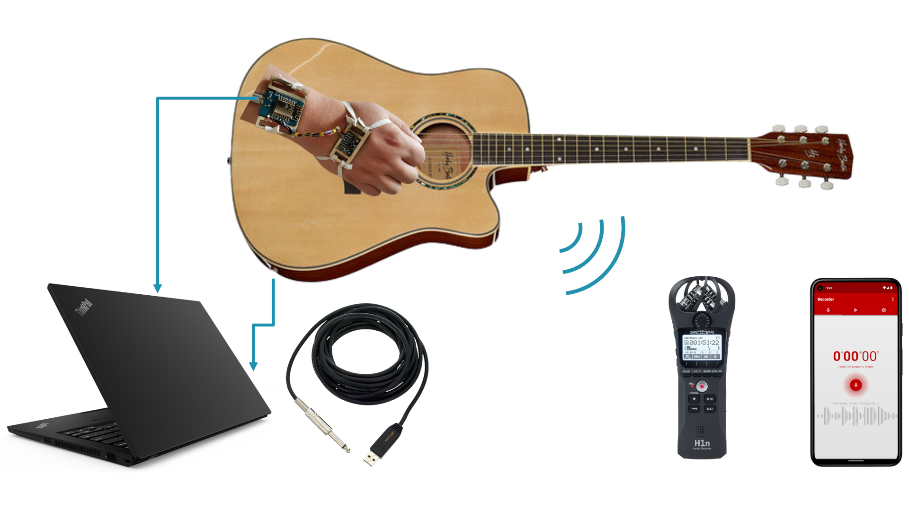
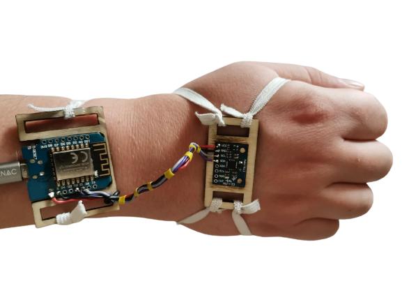

# A Multimodal Approach to Acoustic Guitar Strumming Action Transcription

<p align="center">

</p>

Supplementary materials for ISMIR 2022 LBD submission:
https://archives.ismir.net/ismir2022/latebreaking/000032.pdf

## Dataset

- Chords played: C-major, G-major, F-major, A-minor
- Duration: 10 examples with a total duration of 5 minutes
- Motion signal synchronized to audio signals
- Labels for up and down strumming events

The files can be found in the "dataset" subdirectory.

### Motion Signal Recording

The motion signal is recording using affordable hardware setup. The IMU used is an GY-521 6-axis gyros\-cope and accelerometer which is mounted to the back of the hand of the guitar player.

<p align="center">

</p>

### Structure of an Example

- xyz_line.wav -> Line Audio Recording using Behringer GUITAR 2 USB cable
- xyz_phone.wav -> Smartphone Audio Recording
- xyz.csv -> Motion signal recording stored in csv format with time and value columns
- xyz.strums -> Strumming annotations

## Evaluation of the Baseline Method

A baseline method has been implemented which uses audio for strumming event detection and the hand motion signal for strumming direction classification.

```
python scripts/evaluate.py
```

### Evaluation Results

| **Strumming Class** | **Precision** | **Recall** | **F1 Score** |
|---------------------|---------------|------------|--------------|
| Down strums         | 89.88%        | 94.53%     | 91.94%       |
| Up strums           | 79.14%        | 93.07%     | 84.65%       |

## Attribution

If you use this code or dataset in your research, please cite us via the following BibTeX:

```
@article{murgul2022multimodal,
  title={A Multimodal Approach to Acoustic Guitar Strumming Action Transcription},
  author={Murgul, Sebastian and Heizmann, Michael},
  journal={Proc. ISMIR Late-Breaking and Demo},
  year={2022}
}
```